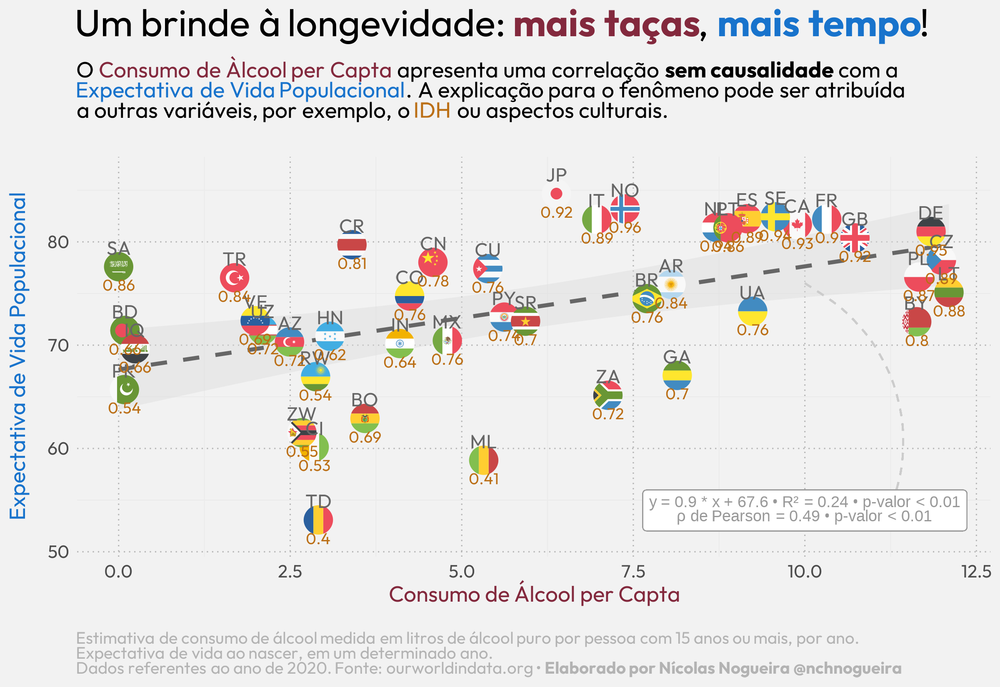

# Portfólio de Análise de Dados - Nícolas Chenquel Nogueira

[](https://opensource.org/licenses/MIT)
[](https://www.r-project.org)

🌍 **Bem-vindo ao meu repositório de projetos em Ciência de Dados!**  
Um espaço dedicado à análise exploratória, visualização criativa e storytelling com dados.

---

## 📌 Sobre Mim

**Nícolas Chenquel Nogueira**  
🎓 Licenciado em Ciências Biológicas pela *Universidade Federal do Rio de Janeiro*  
💻 Programador em Linguagem R | 📊 Analista de Dados | 📈 Especialista em Visualização Científica

Combinando formação em ciências naturais com expertise técnica, desenvolvo análises que traduzem dados complexos em insights acionáveis. Minha abordagem enfatiza:
- Rigor estatístico com clareza narrativa
- Visualizações autoexplicativas
- Reproducibilidade científica
- Integração interdisciplinar

**Habilidades Técnicas:**  
`R` `tidyverse` `ggplot2` `shiny` `markdown` `Git` `Estatística Descritiva` `Análise Espacial`

---

## 📂 Visão Geral do Repositório

### Projeto em Destaque: **Análise Socioepidemiológica - Consumo de Álcool vs Indicadores Globais**

  
*Visualização interativa produzida com ggplot2 e ggflags*

**Contexto Analítico:**  
Investigação da relação entre consumo de álcool per capita, IDH e expectativa de vida em 45 países (2020). Detalhes técnicos:
- Fontes: Our World in Data
- Técnicas: Modelagem linear, análise de correlação
- Ferramentas: `tidyverse`, `countrycode`, `ggtext`

**Principais Insights:**  
- Correlação significativa positiva moderada (ρ = 0.49; p < 0.01) entre variáveis  
- Padrões geoeconômicos identificados  
- IDH como fator mediador relevante  
*(Nota: Correlação ≠ Causalidade)*

---

## 🛠️ Instalação e Uso

Para reproduzir as análises:

```bash
# Clonar repositório
git clone https://github.com/nchnogueira/Portifolio

# Instalar dependências (R >= 4.1.0)
```
