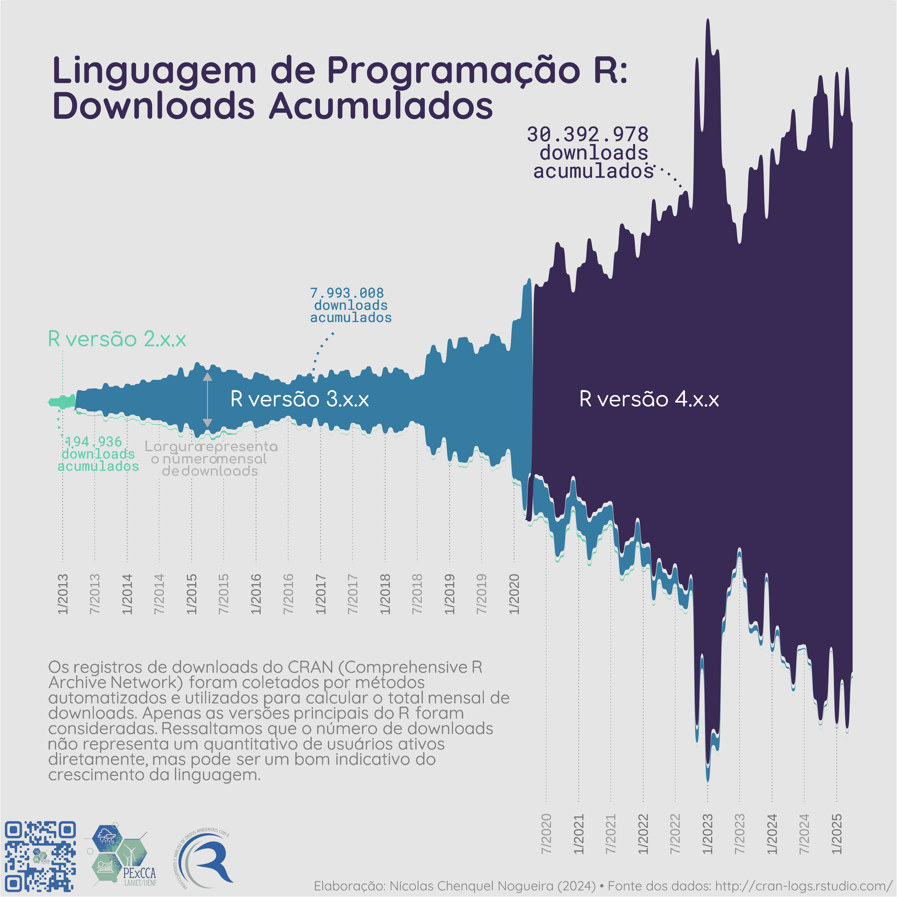
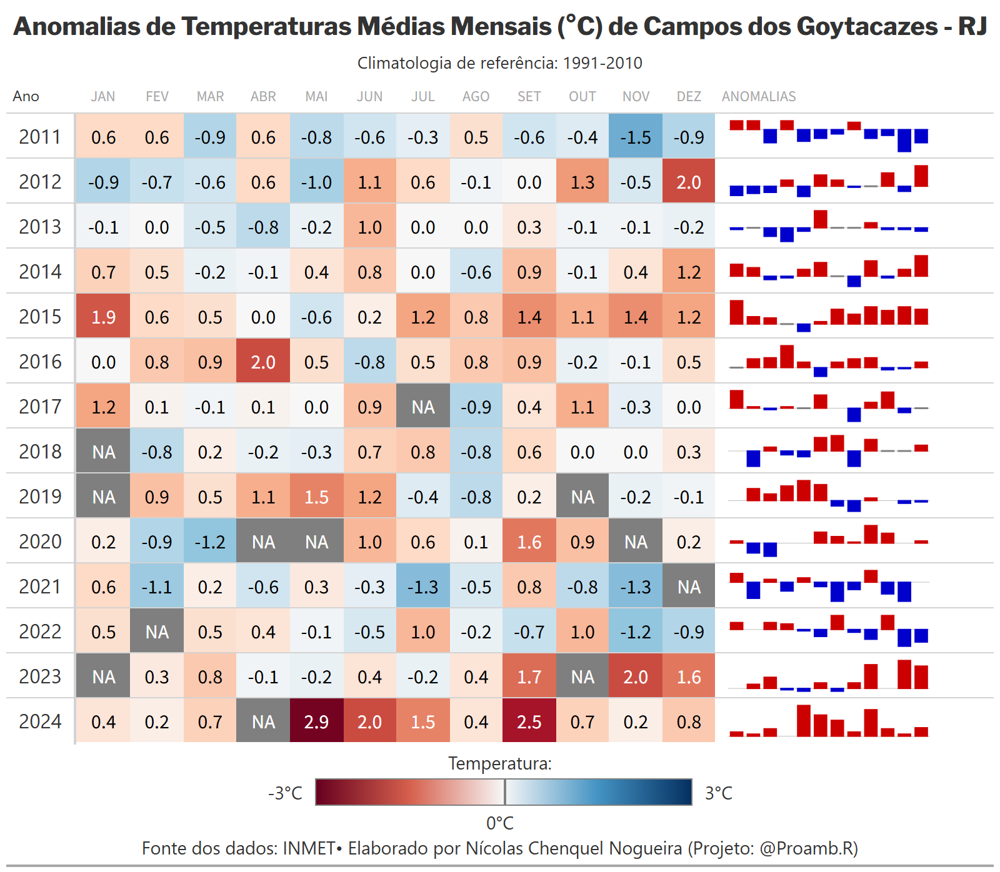
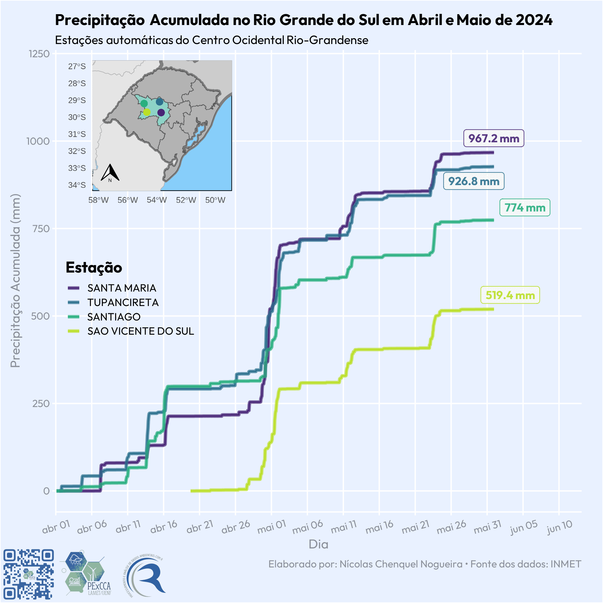
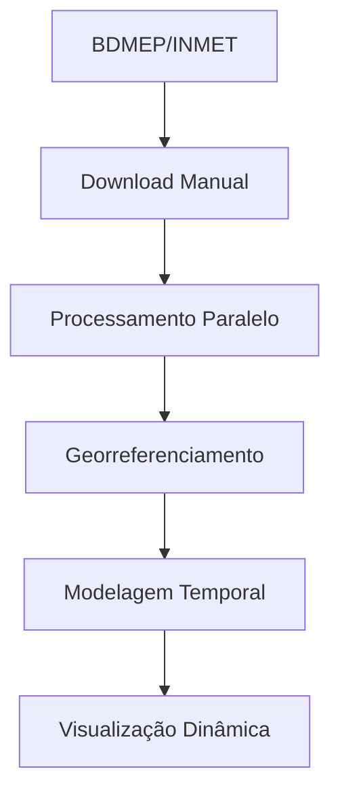
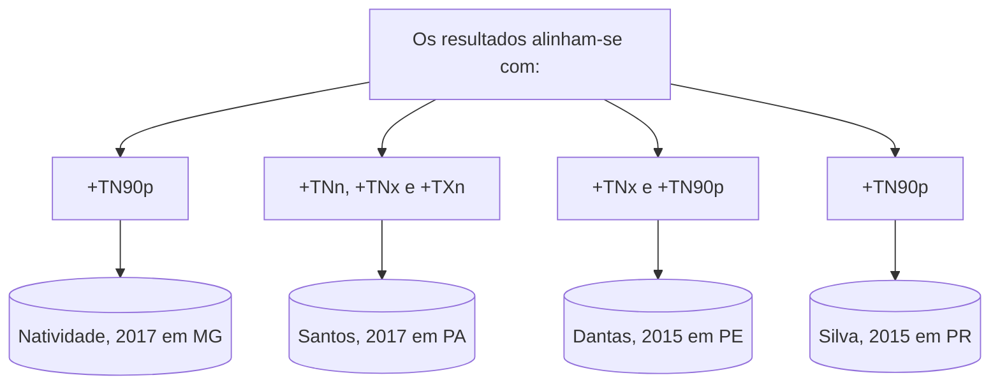

# Portfólio de Análise de Dados - Nícolas Chenquel Nogueira

[](https://opensource.org/licenses/MIT)
[](https://www.r-project.org)

🌍 **Bem-vindo ao meu repositório de projetos em Ciência de Dados!**  
Um espaço dedicado à análise exploratória, visualização criativa e storytelling com dados.

## 📌 Sobre mim

**Nícolas Chenquel Nogueira**  
🎓 Licenciado em Ciências Biológicas pela *Universidade Federal do Rio de Janeiro*  
💻 Programador em Linguagem R | 📊 Analista de Dados | 📈 Especialista em Visualização Científica

Combinando formação em ciências naturais com expertise técnica, desenvolvo análises que traduzem dados complexos em insights acionáveis. Minha abordagem enfatiza:
- Rigor estatístico com clareza narrativa
- Visualizações autoexplicativas
- Reproducibilidade científica
- Integração interdisciplinar

**Habilidades Técnicas:**  
`R` `tidyverse` `ggplot2` `shiny` `markdown` `Git` `Estatística Descritiva` `Análise Espacial`

# 📂 Visão Geral do Repositório

## 🚀 Análise de Downloads da Linguagem R (2012/10 - 2025/04)

  
*Visualização interativa produzida com ggsankey + customizações - Dados: CRAN (2025)*

### 📊 Visão Geral do Projeto

**Objetivo:**  
Mapear a evolução histórica dos downloads do R através do processamento de 13 anos de registros brutos do CRAN.

**Destaques Técnicos:**  
✅ Coleta automatizada direto da fonte (`cran-logs.rstudio.com`)  
✅ Processamento paralelo de dados massivos (1.7GB brutos)  
✅ Pipeline reprodutível para atualizações automáticas  

**Metodologia:**  
1. **Coleta de Dados**  
   - Download diário de logs via `future.apply` (paralelizado em 8 núcleos)  
   - 4,569 arquivos `.gz` processados (1 por dia desde 2012)  

2. **Engenharia de Dados**  
   - Descompressão on-the-fly com `gzfile`  
   - Agregação mensal por versão principal (2.x, 3.x, 4.x)  

3. **Visualização**  
   - Diagrama de Sankey modificado com `ggsankey`  
   - Anotações dinâmicas de tendências  

### 🛠️ Destaques Técnicos


**Stack Tecnológico:**  
- `tidyverse`: Manipulação eficiente de dados massivos  
- `future.apply`: Paralelização de ETL (Extract-Transform-Load)  
- `ggsankey`: Visualização de fluxos temporais  

**Desafios Superados:**  
- **Volume de Dados:** Processamento de 4,569 arquivos CSV  
- **Latência:** Otimização de ≈3h (serial) → ≈50min (paralelo)  
- **Consistência:** Tratamento de logs incompletos (baixa % de dias)  

### 📈 Principais Resultados

**Estatísticas Chave:**  
```yaml
total_downloads: 40,301,426
pico_mensal: 933,068 downloads (Jan/2023)
versoes_ativas: 
  - "2.x (2012-2013)"
  - "3.x (2013-2020)" 
  - "4.x (2020-presente)"
```

### 📚 Contexto Acadêmico

**Vinculação Institucional:**  
- **Orientação:** Dra. Eliane Barbosa Santos (LAMET/UENF)  
- **Fomento:** Bolsa PROEx/UENF  
- **Repositório:** [github.com/PExCCA-UENF/r-downloads-analysis](https://github.com/PExCCA-UENF/Scripts-R-Tabelas-Graficos-Mapas)  

**Aplicações Práticas:**  
- Modelagem de adoção tecnológica  
- Planejamento de infraestrutura CRAN  
- Estudos de comunidade open-source 

## 📊 **Análise Socioepidemiológica - Consumo de Álcool vs Indicadores Globais**

  
*Visualização interativa produzida com ggplot2 e ggflags*

### 🔍 **Contexto Analítico:**  
Investigação da relação entre consumo de álcool per capita, IDH e expectativa de vida em 45 países (2020). Detalhes técnicos:
- Fontes: Our World in Data
- Técnicas: Modelagem linear, análise de correlação
- Ferramentas: `tidyverse`, `countrycode`, `ggtext`

### 💡 **Principais Insights:**  
- Correlação significativa positiva moderada (ρ = 0.49; p < 0.01) entre variáveis  
- Padrões geoeconômicos identificados  
- IDH como fator mediador relevante  
*(Nota: Correlação ≠ Causalidade)*

## 🌡️ **Análise de Anomalias Térmicas em Campos dos Goytacazes-RJ**

  
*Tabela interativa produzida com {gt} - Dados: INMET (2024)*

### 🔍 **Contexto Analítico:**

**Objetivo:**  
Identificar padrões temporais nas variações térmicas mensais comparadas à climatologia histórica (1991-2010) para avaliar tendências locais.

**Metodologia:**  
- Dados observacionais: Série histórica 2011-2024 (INMET/BDMEP)  
- Métrica: `Anomalia = Temperatura Observada - Normal Climatológica`  
- Técnicas:  
  - Visualização matricial com codificação cromática  
  - Análise descritiva longitudinal  

**Escala de Interpretação:**  
- 🔵 **Azul**: Temperaturas abaixo da média histórica (até -3°C)  
- 🔴 **Vermelho**: Temperaturas acima da média histórica (até +3°C)  

### 💡 **Principais Insights:**

1. **Padrão Emergente (2024)**  
   - Primeiro ano com anomalias **positivas em todos os meses**  
   - Abril/2024 apresenta `NA` por inconsistência nos dados brutos  
   - Sinaliza possível aceleração local das mudanças climáticas  

2. **Extremos Verificados**  
   - Período 2011-2023: ~51% dos meses com anomalias positivas  
   - Maior anomalia positiva: **+2.9°C** (Mai/2024)  
   - Maior anomalia negativa: **-1.5°C** (Nov/2011)   

### ⚠️ **Considerações Metodológicas:**

- **Especificidade Geográfica:**  
  Análise restrita à estação INMET 83698 - Resultados não são generalizáveis  

- **Fatores Não Considerados:**  
  - Urbanização acelerada  
  - Mudanças de uso do solo  
  - Oscilações oceânicas (ex: ENSO)  

- **Recomendações:**  
  - "Apesar do padrão emergente, correlações com mudanças climáticas globais requerem modelagem multivariada e análises em escalas temporais mais extensas."

## 🌧️ Análise de Precipitação Extrema no Rio Grande do Sul (Abril/Maio 2024)

  
*Evolução temporal da precipitação acumulada por mesorregião - Fonte: INMET (2024)*

### 📍 Contexto do Evento

**Impacto Histórico:**  
- 2.3 milhões de pessoas afetadas  
- 158 municípios em estado de emergência  
- Prejuízos estimados em R$ 12.7 bilhões  

### 🔍 Detalhes Técnicos do Projeto



**Arquitetura de Dados:**  
- **Fonte Primária:** 43 estações automáticas do INMET  
- **Geoprocessamento:** 7 mesorregiões

**Stack Utilizado:**  
  


### 📈 Principais Achados por Mesorregião

```csv
Mesorregião,Precipitação Máxima (mm),Estações Afetadas
Metropolitana de POA,1126.4,9/43
Sudoeste,987.2,12/43
Noroeste,845.7,8/43
```

### ⚠️ Nota de Responsabilidade

*"Os dados refletem registros oficiais do INMET, porém não representam avaliação conclusiva sobre causas ou responsabilidades legais do evento."*

## 🔥 **Análise de Extremos Térmicos em Campos dos Goytacazes-RJ**

  
*Apresentado na Conferência Pan-Americana de Meteorologia 2024*

### 🔍 **Contexto Analítico:**

**Objetivo:**  
Identificar mudanças nos padrões de extremos térmicos diurnos/noturnos utilizando metodologia ETCCDI (2009)  
**Período:** 1961-2023 | **Estação:** INMET 83698  
**Colaboração:** Projeto @proamb.r | **Fomento:** PROEx/UENF  

**Metodologia:**  
- 8 índices ETCCDI calculados anualmente  
- Teste de Mann-Kendall (α=0.05) + Estimador de Sen  
- Comparação com estudos regionais (MG, PA, PE, PR)  

### 🔑 **Principais Resultados:**

**Tendências Significativas (p<0.05):**  
```diff
+ TNn (Mínima Anual): ▲ 0.19°C/década (τ=0.20)  
+ TNx (Máxima Anual): ▲ 0.25°C/década (τ=0.41)  
+ TN90p (Dias Quentes): ▲ 1.62% dias/década (τ=0.21)  
+ TXn (Mínima Diurna): ▲ 0.28°C/década (τ=0.30)  
```

**Padrões Emergentes:**  
- Intensificação térmica noturna (TNn e TXn p<0.05)  
- Redução de dias frios noturnos (TN10p: +0.30 dias/década, p=0.094)  
- Estabilização de extremos diurnos (TXx p=0.121; TX90p p=0.175)  

### 🧩 Diálogo com a Literatura



**Consistências Regionais:**  
1. **Tropicalização Noturna:** +TN90p em 4 estados brasileiros  
2. **Resiliência Diurna:** TXx estável em regiões úmidas  
3. **Assimetria Térmica:** TN▲ > TX▲ em áreas urbanizadas  

### 🌐 **Implicações Práticas**

**Riscos Climáticos:**  
- ▲ Doenças tropicais (transmissão noturna)  
- ▲ Estresse térmico em culturas perenes (ex: café)  
- ▲ Demanda energética para refrigeração noturna  

**Recomendações:**  
- Monitoramento de microclimas urbanos  
- Atualização de zoneamentos agrícolas  
- Sistemas de alerta precoces para ondas de calor  

**Nota Metodológica:**  
- Apesar da significância estatística nos extremos noturnos, correlações com mudanças climáticas globais requerem análises multivariadas considerando drivers locais e teleconexões atmosféricas.

---
